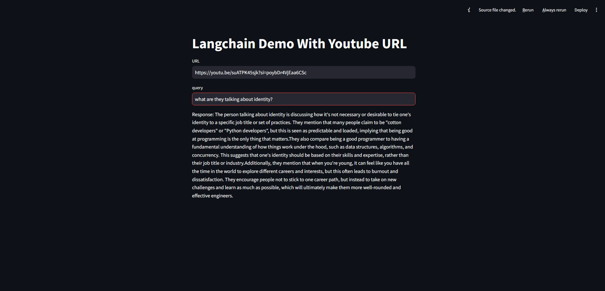

# LangChain YouTube Transcript Question Answering

This application demonstrates how to use LangChain to process YouTube video transcripts, store them in a FAISS vector database, and query them using an LLM (locally hosted model). The app is built with Streamlit for a simple user interface.

## Features
- Extracts and splits YouTube video transcripts into manageable chunks.
- Embeds transcript chunks using HuggingFace Sentence Transformers (`all-MiniLM-L6-v2`).
- Stores embeddings in a FAISS vector database for similarity search.
- Uses a local LLM for answering user queries about the video content.
- Supports Streamlit for easy input and output interaction.

## Workflow
1. **Extract Transcript**: Load the YouTube video's transcript using `YoutubeLoader`.
2. **Text Splitting**: Split the transcript into smaller chunks using `RecursiveCharacterTextSplitter` to handle long documents.
3. **Embedding**: Embed the text chunks with `HuggingFaceEmbeddings`.
4. **Vector Store**: Save the embeddings in a FAISS vector database.
5. **Query Response**: Perform similarity search on the database and use the LLM (`llama-3.2-1b-instruct`) to generate responses based on the most relevant chunks.

<font color="red">⚠️**WARNING**</font>: I use my LLM (locally hosted model).

The folowing python libraries are used
- HuggingFaceEmbeddings (For creating embeddings)
- FAISS (For efficient similarity search)
- Langchain (Python framework for developing apps powered by LLM)
- Streamlit (Frontend UI for the chatbot)



## Table of Contents

- [Installation](#installation)
- [Acknowledgements](#acknowledgements)

## Installation

Include instructions on how to install your project. You can include the following:

- Prerequisites
1. Clone this repo
2. Create the python virtual environment inside the cloned directory
```console
conda create..
```

3. Install the pre-requisite 
WARNING: Will take considerable time to install all the dependent packages.

```console
pip install -r requirements.txt
```

- How to run the project
```console
streamlit run app.py
```

## Acknowledgements

Most of the code is borrowed from the following
https://python.langchain.com/v0.1/docs/modules/data_connection/document_transformers/recursive_text_splitter/
https://api.python.langchain.com/en/latest/character/langchain_text_splitters.character.RecursiveCharacterTextSplitter.html
